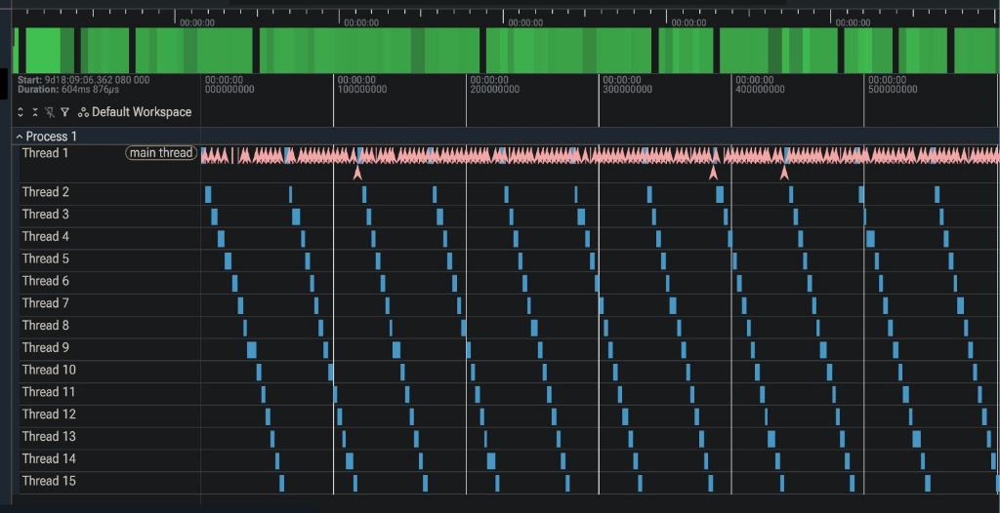

<div align="center">

# Thread Scheduler VM

**Custom C++ Virtual Machine & Preemptive OS Scheduler**

Powered by a Fetch-Decode-Execute Pipeline and Microsecond Telemetry

[](https://en.cppreference.com/w/cpp/17)
[](https://invisible-island.net/ncurses/)
[](https://ui.perfetto.dev/)
</div>

---

## Overview

Thread Scheduler VM is a **bare-metal software emulator** that implements a custom CPU architecture and a fully functional operating system scheduler from scratch. It is designed to visualize and profile exactly how modern computers handle high-concurrency workloads.

Unlike standard application-level threading (like `std::thread`), this project **builds the hardware illusion itself**. It physically swaps simulated CPU registers into Thread Control Blocks (TCBs) and forcefully preempts execution using a Round-Robin algorithm to manage 15+ concurrent execution streams on a single core.

### Working (Big Picture)
```text
Compiled Binary ──▶ Memory ──▶ CPU (Fetch/Decode/Execute) ──▶ ncurses UI
                                  │                ▲
                      Save Regs   │                │ Restore Regs
                      to TCB      ▼                │ from TCB
                            ┌────────────────────────────┐
                            │ OS Preemptive Scheduler    │
                            │ (Round-Robin Queue)        │
                            └────────────────────────────┘
```
The system operates in three parallel phases:
1. **Phase 1 (Emulation)** — The CPU runs a classic hardware pipeline (Fetch-Decode-Execute) using internal registers (PC, IR, R0-R3) to process 8-bit instructions.
2. **Phase 2 (Scheduling)** — After a strict time quantum (4 cycles), the Guest OS fires a timer interrupt, rips control from the CPU, saves the hardware state, and loads the next thread.
3. **Phase 3 (Observability)** — The `ncurses` visualizer continuously intercepts the hardware state and paints a 60FPS live dashboard to the terminal without blocking the CPU execution pipeline.

### The Fetch-Decode-Execute Cycle
```text
                      +===============================+
                      |    CPU CORE PIPELINE LOOP     |
                      +===============================+
                                      |
     +--------------------------------+                    +-----------------+
     |                                                     |                 |
     ▼                                                     ▼                 |
+-------------------------------------------------------------------+        |         
| [ FETCH STAGE ]                                                   |        |        
| 1. Send Program Counter (PC) to Memory Address                    |        |
| 2. Retrieve 8-bit Instruction from simulated RAM                  |        |       
| 3. Load Instruction into Instruction Register (IR)                |        |
| 4. Increment PC (PC = PC + 1)                                     |        |
+-------------------------------------------------------------------+        |
     |                                                                       |
     ▼                                                                       |
+-------------------------------------------------------------------+        |
| [ DECODE STAGE ]                                                  |        |
| 1. Control Unit reads the IR                                      |        |
| 2. Parse Opcode (e.g., OP_SUB, OP_LOAD)                           |        |
| 3. Fetch Operands (Identify Target Registers R0-R3)               |        |
+-------------------------------------------------------------------+        |
     |                                                                       |
     ▼                                                                       |
+-------------------------------------------------------------------+        |
| [ EXECUTE STAGE ]                                                 |        |
| 1. Route data to Arithmetic Logic Unit (ALU)                      |        |
| 2. Perform math/logic (e.g., R0 = R0 - R1)                        |        |
| 3. Write result back to Target Register                           |        |
+-------------------------------------------------------------------+        |
     |                                                                       |
     ▼                                                                       |
   [ SCHEDULER TIMER INTERRUPT CHECK ]                                       |
   Is Quantum Tick == 4?                                                     |
     |               |                                                       |
   (No)            (Yes)                                                     |
     |               |                                                       |
     |               ▼                                                       |
     |         +---------------------------------------+                     |
     |         | [ YIELD STAGE ]                       |                     |
     |         | 1. Suspend CPU                        |                     |
     |         | 2. Save R0-R3 to TCB                  |                     |
     |         +---------------------------------------+                     |
     |               |                                                       |
     |               ▼                                                       |
     |         (Later Resumed)                                               |
     |               |                                                       |
     +---------------+                                                       |
     |                                                                       |
     ▼                                                                       |
  (Loop back to Fetch Stage)                                                 |
     |                                                                       |
     +-----------------------------------------------------------------------+
```

**Pipeline Mechanics:**
* **Fetch:** The emulation core accesses the simulated RAM array using the current raw address stored in the `PC` register. It extracts the raw byte into the Instruction Register (`IR`) and immediately increments the pointer so it is ready for the next cycle.
* **Decode:** The internal control logic evaluates the byte inside the `IR`. It determines the instruction type and looks ahead in memory if the instruction requires immediate values (like loading `30` into `R0`).
* **Execute:** The Arithmetic Logic Unit (ALU) executes the decoded instruction—whether that is modifying the general-purpose registers (`R0`-`R3`), printing to the UI, or altering the `PC` for a conditional jump (`OP_JNZ`).
---

## Features

- **Custom Instruction Set (ISA)** — Complete fetch-decode-execute pipeline with `LOAD`, `ADD`, `SUB`, `JNZ`, `PRINT`, and `HALT` opcodes.
- **Hardware-Level Context Switching** — True physical register swapping via custom Thread Control Blocks (TCBs).
- **Preemptive Round-Robin Scheduling** — Dynamic OS-level queue managing 15+ concurrent execution streams without deadlocks.
- **Microsecond Profiler** — Native integration with the Chrome Trace Event format for deep-dive Perfetto graphs.
- **Live Observability Dashboard** — Low-latency terminal UI powered by `ncurses` mapping Program Counters and CPU states at 60FPS.

---

### Core Components

| Component | Tech | Purpose |
|---|---|---|
| **Memory** | `std::vector<uint8_t>` | Simulated RAM; handles dynamic program loading and instruction patching. |
| **CPU** | C++ State Machine | Executes ISA opcodes. Completely blind to the existence of multiple threads. |
| **Scheduler** | C++ Queue Logic | The "Guest OS". Manages execution fairness and triggers context switches. |
| **Trace Writer** | Standard I/O (`fstream`) | Logs execution boundaries and OS overhead in microsecond precision. |
| **Visualizer** | `ncurses` | Renders a decoupled, read-only terminal dashboard of system state. |

---

## Architecture

```text
┌─────────────────────────────────────────────────────────────────┐
│                     Virtual Machine Host                        │
├───────────────────────┬─────────────────────────────────────────┤
│  Hardware Emulation   │  Operating System (Guest)               │
│  ┌─────────────────┐  │  ┌───────────────────────────────────┐  │
│  │  Memory (RAM)   │  │  │  Thread Scheduler (Round-Robin)   │  │
│  │  20,000 bytes   │  │  │  [ Ready Queue ] <──> [ TCBs ]    │  │
│  └───────┬─────────┘  │  └─────────────────┬─────────────────┘  │
│          │            │                    │                    │
|          ▼            |                    |                    |
│  ┌─────────────────┐  │                    │                    │
│  │  CPU Pipeline   │◀─┼────────────────────┘                    │
│  │  R0-R3, PC, ALU │  │  Forces Context Switch via Time Quantum │
│  └───────┬─────────┘  │                                         │
├──────────┼────────────┴─────────────────────────────────────────┤
│          ▼                                                      │
│  ┌─────────────────┐     ┌───────────────────────────────────┐  │
│  │ ncurses UI      │     │ High-Res Telemetry Writer         │  │
│  │ Live Dashboard  │     │ vm_trace.json                     │  │
│  └─────────────────┘     └───────────────────────────────────┘  │
└─────────────────────────────────────────────────────────────────┘
```

---
## Project Structure
```text
thread_scheduler_vm/
├── include/                # Header definitions
│   ├── cpu.h               # ISA and CPU state
│   ├── memory.h            # RAM allocation
│   ├── scheduler.h         # TCBs and Round-Robin logic
│   └── visualizer.h        # ncurses UI abstraction
├── src/                    # Core Implementation
│   ├── cpu.cpp             # Fetch-Decode-Execute pipeline logic
│   ├── memory.cpp          # Byte-code loading & read/write access
│   ├── scheduler.cpp       # Context switching & queue management
│   └── visualizer.cpp      # Terminal rendering & real-time updates
├── main.cpp                # VM Initialization & Telemetry loop
├── vm_trace.json           # Auto-generated Perfetto profile
└── README.md
```

---

## Getting Started

### Prerequisites

- **C++17** or higher
- **Make** / **CMake**
- **ncurses** library (Required for UI)

### Installation Linux (Ubuntu)
```bash
# Clone
git clone https://github.com/ArjunTomar-G/thread_scheduler_vm.git
cd thread_scheduler_vm

# Install ncurses dependency
sudo apt update
sudo apt install libncurses5-dev libncursesw5-dev
```

*(For Arch Linux: `sudo pacman -S ncurses`)*

### Compiling & Running

**Compile the VM:**
```bash
g++ -I./include src/*.cpp -lncurses -o vm
```
**Execute the System:**
```bash
./vm
```
---

## Observability & Profiling

This system completely decouples the CPU emulation from the observability layer, allowing for zero-latency monitoring and microsecond-accurate bottleneck profiling.

### 1. Live Terminal Dashboard (ncurses)
During execution, the standard output is hijacked by an `ncurses` UI. This provides a real-time, 60FPS read-only view into the physical hardware registers and the OS scheduler's active Thread Control Block (TCB).

```text
+--------------------------------------------------+
|           THREAD SCHEDULER VM - ncurses          |
+--------------------------------------------------+
|                                                  |
|  [ CPU REGISTERS ]                               |
|  R0 : 25                  R2 : 0                 |
|  R1 : 1                   R3 : 0                 |
|                                                  |
|  [ EXECUTION CONTEXT ]                           |
|  Program Counter (PC): 0x000B                    |
|  Current Opcode      : OP_SUB                    |
|                                                  |
|  [ OS SCHEDULER ]                                |
|  Active Thread ID    : 4                         |
|  Quantum Tick        : 3 / 4                     |
|  System State        : RUNNING                   |
|                                                  |
+--------------------------------------------------+
```

*The dashboard above demonstrates the CPU executing a countdown sequence inside R0 and R1, while the Guest OS perfectly tracks the Program Counter (PC) and current active Thread ID.*

### 2. High-Density Google Perfetto Graphs
Because the VM executes instructions in microseconds, human observation is insufficient for debugging. The VM automatically logs every context switch and thread execution block to a Chrome Trace Event (`vm_trace.json`) format.



**Graph Analysis:**
* **The Main Thread (Top Row):** The pink spikes represent the exact OS scheduler overhead—measuring the microsecond latency of ripping registers out of the CPU and saving them to the TCB.
* **The Cascade (Bottom Rows):** The blue blocks prove the Round-Robin algorithm is flawlessly time-slicing 15 concurrent threads, ensuring perfectly fair execution time without overlapping or race conditions.

---