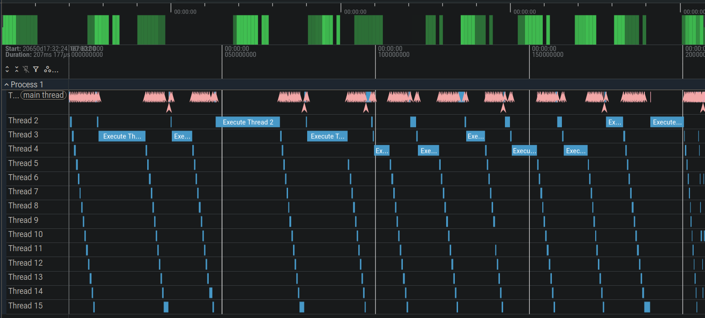
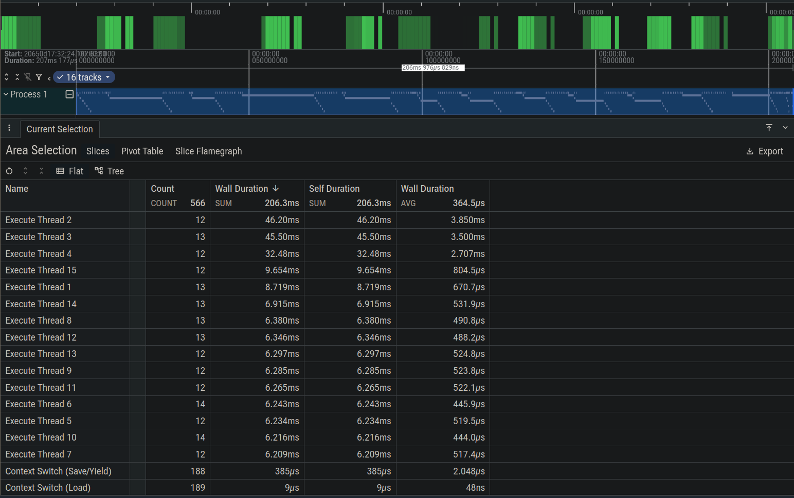

<div align="center">

# Thread Scheduler VM

**Custom C++ Virtual Machine & MLFQ Operating System Simulator**

Featuring a Software Fetch-Decode-Execute Cycle, Software Interrupts, and Microsecond Telemetry

[](https://en.cppreference.com/w/cpp/17)
[](https://invisible-island.net/ncurses/)
[](https://ui.perfetto.dev/)
</div>

---

## Overview

Thread Scheduler VM is a **Software-based Virtual Machine and Operating System Simulator** that implements a custom CPU architecture and a Preemptive MLFQ scheduler from scratch. It is designed to demonstrate and visualize the fundamental mechanisms behind CPU execution, thread scheduling, context switching, interrupts, and mutex synchronization.

Unlike standard application-level threading (like `std::thread`), this project **emulates CPU execution and OS scheduling in software.** It saves and restores simulated CPU registers into Thread Control Blocks (TCBs), allocates independent stack frames via an OS bump allocator, and dynamically schedules 15+ concurrent execution streams using a **Multi-Level Feedback Queue (MLFQ)**.

To strictly mirror real-world computing architecture, the CPU emulation is entirely decoupled from the OS Layer. They communicate through timer interrupts generated by the virtual CPU and **Software Interrupts (Syscalls)** to handle thread termination and mutex acquisition.

### Working (Big Picture)
```text
Bytecode Program ──▶ Memory (Bump Allocator) ──▶ CPU Pipeline ──▶ ncurses UI
                                  │                ▲
            Syscall / Timer Inter.│                │ Context Load
            (Save Context to TCB) ▼                │ (PC, SP, Regs)
                            ┌────────────────────────────┐
                            │ OS Preemptive Scheduler    │
                            │ ├── [Q0] High Priority     │
                            │ ├── [Q1] Medium Priority   │
                            │ └── [Q2] Low (CPU Heavy)   │
                            └────────────────────────────┘
```
The system operates in three coordinated phases:
1. **Phase 1 (Emulation)** — The CPU runs a classic Fetch-Decode-Execute pipeline using internal registers (PC, SP, R0-R3). When a thread is created, the OS uses a bump allocator starting at the top of memory (19999) to safely grant the thread a dynamic independent stack regions.
2. **Phase 2 (Scheduling & MLFQ)** — The OS completely dictates execution. If a thread hogs the CPU for a full time quantum (8 cycles), a Timer Interrupt fires, the thread is preempted, and it is demoted to a lower-priority queue. If the CPU hits a Software Interrupt (like OP_LOCK or OP_HALT), execution is immediately yielded back to the OS to manage mutex wait-queues or thread termination.
3. **Phase 3 (Observability)** — The ncurses visualizer continuously intercepts the simulated hardware state and renders a live dashboard to the terminal without blocking the CPU execution pipeline.

### The Fetch-Decode-Execute Cycle
```text
                      +===============================+
                      |    CPU CORE PIPELINE LOOP     |
                      +===============================+
                                      |
     +--------------------------------+                    +-----------------+
     |                                                     |                 |
     ▼                                                     ▼                 |
+-------------------------------------------------------------------+        |         
| [ FETCH STAGE ]                                                   |        |        
| 1. Send Program Counter (PC) to Memory Address                    |        |
| 2. Retrieve 8-bit Instruction from simulated RAM                  |        |       
| 3. Load Instruction & Increment PC                                |        |
+-------------------------------------------------------------------+        |
     |                                                                       |
     ▼                                                                       |
+-------------------------------------------------------------------+        |
| [ DECODE STAGE ]                                                  |        |
| 1. Control Unit reads the loaded Instruction                      |        |
| 2. Parse Opcode (e.g., OP_SUB, OP_LOAD, OP_PUSH)                  |        |
| 3. Fetch Operands (Registers or Syscall arguments)                |        |
+-------------------------------------------------------------------+        |
     |                                                                       |
     ▼                                                                       |
+-------------------------------------------------------------------+        |
| [ EXECUTE STAGE ]                                                 |        |
| 1. Route data to ALU or modify Stack Pointer (SP)                 |        |
| 2. Perform math/logic or read/write memory                        |        |
| 3. Flag Syscalls (OP_LOCK, OP_UNLOCK, OP_HALT)                    |        |
+-------------------------------------------------------------------+        |
     |                                                                       |
     ▼                                                                       |
   [ INTERRUPT CHECK ]                                                       |
   Did a Syscall fire OR did Quantum Tick == 8?                              |
     |               |                                                       |
   (No)            (Yes)                                                     |
     |               |                                                       |
     |               ▼                                                       |
     |         +---------------------------------------+                     |
     |         | [ YIELD STAGE ]                       |                     |
     |         | 1. Suspend CPU                        |                     |
     |         | 2. Save R0-R3, PC, SP to TCB          |                     |
     |         | 3. Route to MLFQ or Blocked Queue     |                     |
     |         +---------------------------------------+                     |
     |               |                                                       |
     |               ▼                                                       |
     |         (Later Resumed)                                               |
     |               |                                                       |
     +---------------+                                                       |
     |                                                                       |
     ▼                                                                       |
  (Loop back to Fetch Stage)                                                 |
     |                                                                       |
     +-----------------------------------------------------------------------+
```

**Advanced Pipeline Mechanics:**
* **Context Isolation:**The CPU is entirely blind to the existence of multiple threads. It only knows what is currently in its registers. The OS saves and restores swaps out the `PC`,`SP`, and general-purpose registers during a context switch.
* **Starvation Prevention:** To prevent CPU-heavy threads in lower queues from starving I/O or blocked threads, the Scheduler executes a priority boost every 50 context switches, moving all active threads back to Queue 0.
* **Mutex Synchronization:** If a thread calls `OP_LOCK` on an already-owned mutex, the OS traps the syscall, changes the thread state to `BLOCKED`, moves it to a wait-queue, and immediately forces a context switch to prevent wasted CPU cycles.


### Thread Lifecycle

Every thread in the virtual machine exists in one of four scheduler-managed states:

| State | Description |
|-------|-------------|
| **READY** | The thread is eligible to run and is waiting inside one of the MLFQ priority queues. |
| **RUNNING** | The thread currently owns the virtual CPU and is executing instructions. |
| **BLOCKED** | The thread is waiting on a mutex after an unsuccessful `OP_LOCK` syscall and is removed from the scheduler until the mutex becomes available. |
| **TERMINATED** | The thread has executed `OP_HALT` and has permanently exited execution. |

Typical lifecycle:

```text
           create_thread()
                 │
                 ▼
            READY
              │
      schedule_next()
              │
              ▼
           RUNNING
        ┌─────┴──────────┐
        │                │
Timer Quantum       OP_LOCK fails
Expires                 │
        │               ▼
        ▼           BLOCKED
     READY              │
        ▲               │
        │        Mutex Released
        │               │
        └───────────────┘

            OP_HALT
               │
               ▼
          TERMINATED
```
---

## Features

- **Custom Instruction Set (ISA)** — Complete fetch-decode-execute pipeline with `LOAD`, `ADD`, `SUB`, `JNZ`, `PRINT`, `PUSH`, `POP`, and Syscalls (`HALT`, `LOCK`, `UNLOCK`).
- **Software Context Switching** — Save and restore of simulated CPU registers (`PC`, `SP`, `R0`-`R3`) via custom Thread Control Blocks (TCBs).
- **Multi-Level Feedback Queue (MLFQ)** — Dynamic OS-level scheduling with priority demotion for CPU-bound tasks and priority boosting to prevent starvation.
- **Dynamic Stack Allocation** — OS-managed bump allocator safely assigning independent stack regions in memory for active threads.
- **Microsecond Profiler** — Native integration with the Chrome Trace Event format for deep-dive Perfetto flame graphs.
- **Live Observability Dashboard** — Low-latency terminal UI powered by `ncurses` mapping CPU states.
- **Explicit Thread Lifecycle** — Scheduler-managed `READY`, `RUNNING`, `BLOCKED`, and `TERMINATED` thread states with mutex-based blocking and clean termination.

---

### Core Components

| Component | Tech | Purpose |
|---|---|---|
| **Memory** | `std::vector<uint8_t>` | Simulated RAM providing byte-addressable storage and program loading. |
| **CPU** | C++ State Machine | Executes ISA opcodes and traps Syscalls. Completely blind to the existence of multiple threads. |
| **Scheduler** | MLFQ Logic | The "OS Layer". Manages thread creation, stack allocation, MLFQ scheduling, thread states, mutex synchronization, and context switching. |
| **Trace Writer** | Standard I/O (`fstream`) | Logs execution boundaries and OS overhead in microsecond precision. |
| **Visualizer** | `ncurses` | Renders a decoupled, read-only terminal dashboard of the system state. |
---

## Architecture

```text
┌─────────────────────────────────────────────────────────────────┐
│                     Virtual Machine Host                        │
├───────────────────────┬─────────────────────────────────────────┤
│  Virtual Hardware     │  Operating System (Guest)               │
│  ┌─────────────────┐  │  ┌───────────────────────────────────┐  │
│  │  Memory (RAM)   │  │  │  MLFQ Scheduler & Bump Allocator  │  │
│  │  20,000 bytes   │  │  │  [Q0] ◀─▶ [Q1] ◀─▶ [Q2] (TCBs)    │  │
│  └───────┬─────────┘  │  └─────────────────┬─────────────────┘  │
│          │            │                    │                    │
|          ▼            |                    |                    |
│  ┌─────────────────┐  │                    │                    │
│  │  CPU Pipeline   │◀─┼────────────────────┘                    │
│  │  R0-R3, PC, SP  │  │  Forces Context Switch via Time Quantum │
│  └───────┬─────────┘  │  or traps Syscalls (HALT/LOCK)          │
├──────────┼────────────┴─────────────────────────────────────────┤
│          ▼                                                      │
│  ┌─────────────────┐     ┌───────────────────────────────────┐  │
│  │ ncurses UI      │     │ High-Res Telemetry Writer         │  │
│  │ Live Dashboard  │     │ vm_trace.json                     │  │
│  └─────────────────┘     └───────────────────────────────────┘  │
└─────────────────────────────────────────────────────────────────┘
```

---
## Project Structure
```text
thread_scheduler_vm/
├── include/                # Header definitions
│   ├── cpu.h               # ISA, Syscalls, and CPU state
│   ├── memory.h            # RAM and stack boundary definitions
│   ├── scheduler.h         # TCBs, MLFQ logic, and Mutexes
│   └── visualizer.h        # ncurses UI abstraction
├── src/                    # Core Implementation
│   ├── main.cpp            # VM Initialization, Thread Creation & Telemetry
│   ├── cpu.cpp             # Fetch-Decode-Execute pipeline & Syscall traps
│   ├── memory.cpp          # Byte-code loading & read/write access
│   ├── scheduler.cpp       # MLFQ priority management & Context switching
│   └── visualizer.cpp      # Terminal rendering & real-time updates
├── vm_trace.json           # Auto-generated Perfetto profile
└── README.md
```

---

## Getting Started

### Prerequisites

- **C++17** or higher
- **Make** / **CMake**
- **ncurses** library (Required for UI)

### Installation Linux (Ubuntu)
```bash
# Clone
git clone https://github.com/ArjunTomar-G/thread_scheduler_vm.git
cd thread_scheduler_vm

# Install ncurses dependency
sudo apt update
sudo apt install libncurses5-dev libncursesw5-dev
```

*(For Arch Linux: `sudo pacman -S ncurses`)*

### Compiling & Running

**Compile the VM:**
```bash
g++ -I./include src/*.cpp -lncurses -o vm
```
**Execute the System:**
```bash
./vm
```
---

## Observability & Profiling

This system completely decouples the CPU emulation from the observability layer, allowing for lightweight monitoring and microsecond-accurate bottleneck profiling.

### 1. Live Terminal Dashboard (ncurses)
During execution, the standard output is hijacked by an `ncurses` UI. This provides a real-time dashboard read-only view into the simulated CPU registers and the currently running thread's Thread Control Block (TCB).

```text
┌──────────────────────────────────────────────────┐
│ [ Thread Scheduler VM Dashboard ]                │
│                                                  │
│ --- CPU STATE ---                                │
│ Program Counter (PC): 0x1006                     │
│ R0: 30                                           │
│ R1: 1                                            │
│ R2: 0                                            │
│ R3: 0                                            │
│                                                  │
│ --- SCHEDULER STATE ---                          │
│ Active Thread ID : 4                             │
│ Execution Time   : 24 cycles                     │
└──────────────────────────────────────────────────┘
```

*The dashboard above reflects the actual ncurses window layout, demonstrating the CPU executing a countdown sequence inside R0 and R1 while the OS strictly tracks execution cycles to determine when a running thread has exhausted its execution quantum and should be yielded back to the scheduler.*

### 2. High-Density Google Perfetto Graphs
Because the VM executes instructions in microseconds, human observation is insufficient for debugging. The VM automatically logs every context switch and thread execution block to a Chrome Trace Event (`vm_trace.json`) format.



**Trace Execution Analysis:**
* **MLFQ & Syscall Dynamics:** Unlike a static Round-Robin system, the execution blocks here illustrate the Multi-Level Feedback Queue is actively adapting. You can observe threads executing for a full time quantum (8 cycles) before being demoted to lower queues, or yielding the CPU early when trapping software interrupts like `OP_LOCK` or `OP_HALT`.
* **Visualizing Concurrency:** The top timeline showcases the execution windows (cascading blocks) of the threads. The gaps and clusters prove the dynamic nature of the thread yielding and time-slicing.



**Microsecond Profiling Data:**
* **Micro-Latency OS Overhead:** The area selection table perfectly isolates the OS latency. Stripping the registers and yielding (`Context Switch (Save/Yield)`) takes just ~2μs on average, while pushing the state back into the CPU (`Context Switch (Load)`) takes mere nanoseconds (~48ns).
* **Execution Distribution:** The statistical breakdown proves the scheduler is actively balancing the load. You can see various threads being scheduled 12 to 14 times, with their total execution time dynamically handled based on when they trapped syscalls or exhausted their time quantums.

## Note

This project is an educational virtual machine and operating system simulator.

It demonstrates the core concepts of CPU execution, preemptive scheduling,
context switching, interrupts, mutex synchronization, and thread management.

It is not intended to be a production operating system or a hardware emulator.

---